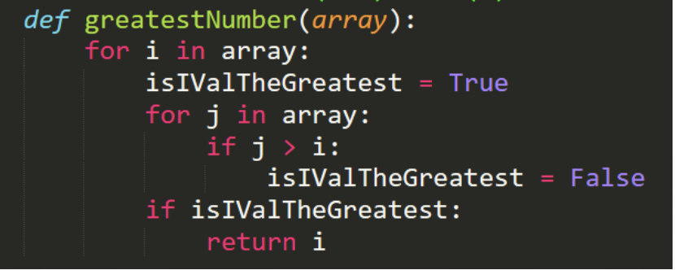

# Ejercicio 1

## ¿Cual es el proposito de este codigo?
Este algoritmo retornara el numero mas grande en el arreglo

## ¿Cual es la complejidad del codigo?
Este algoritmo contiene 2 for anidados que van de 0 al tamaño del array, por tanto la complejidad es O(n^2)

