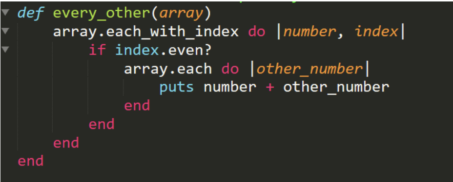

# Ejercicio 2

## ¿Cual es el proposito de este codigo?
Este codigo imprimira la suma de los elementos con indice par con todos los elementos del arreglo

## ¿Cual es la complejidad del codigo?
El primer bucle se repite n veces el segundo n/2 veces, dando como resultado n^2/2 ignoramos la constante 1/2 y obtenemos O(n^2)

