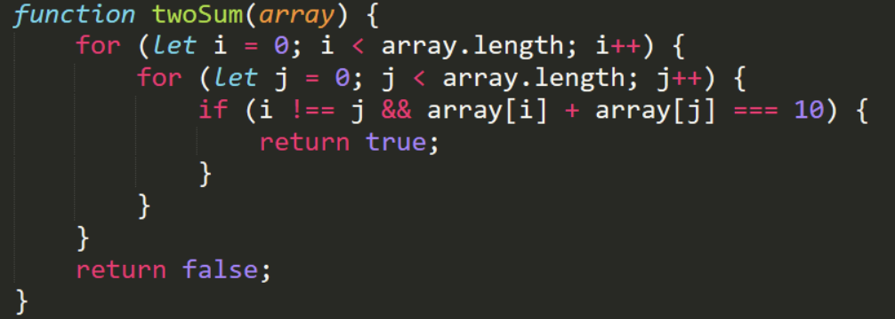

# Ejercicio 3

## ¿Cual es el proposito de este codigo?
Este codigo sumara cada elemento del arreglo con los demas(todos menos con el mismo) y retornara true si alguna de esas sumas es 10 y false si ninguna lo es

## ¿Cual es la complejidad del codigo?
Son dos bucles anidados, ambos se repetiran n veces por tanto el orden es n^2
