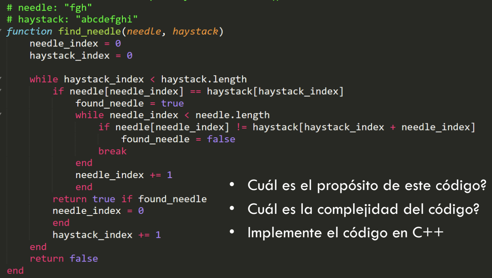

# Ejercicio 4

## ¿Cual es el proposito de este codigo?
Este codigo retornara true si encuentra una cadena dentro de otra y false si no la encuentra

## ¿Cual es la complejidad del codigo?
El primer bucle se repetira n veces donde n es el tamaño de la cadena grande y el segundo bucle m veces, siendo de complejidad O(n*m)
