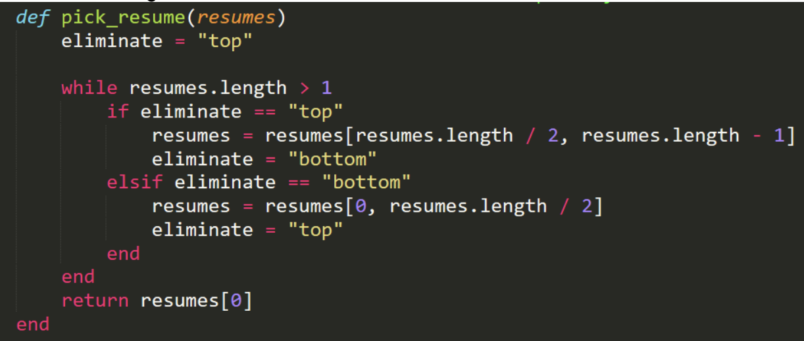

# Ejercicio 5

## ¿Cual es el proposito de este codigo?
Ir elminando a mitades el arreglo hasta que queda un elemento

## ¿Cual es la complejidad del codigo?
La complejidad es Log2n
debido a que divide varias veces el arreglo en 2

