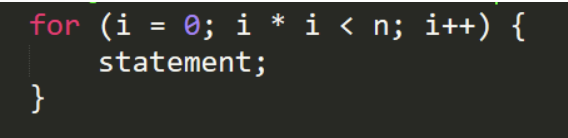

# Ejercicio 6

## Describe paso a paso cual es la complejidad del siguiente codigo

Para un mejor entendimiento llamaremos a i*i cuadrado

entonces 

| i  | cuadrado |
| ------------- | ------------- |
| 0  | 0  |
| 1  | 1  |
| 2  | 2*2|
| 3  | 3*3|
| ...  | ...|
| k | k|

Entonces considerando que i se repita k veces, en la iteracion numero k sera k*K y

>k*k < n

>k2 < n 

k debe ser aproximadamente n1/2

O(n1/2) 