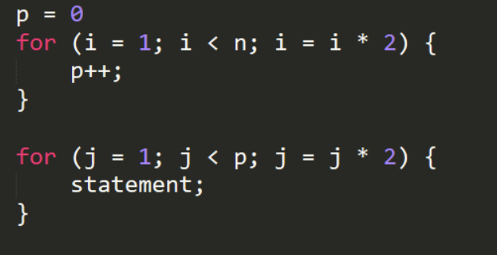

# Ejercicio 7

## Describe paso a paso cual es la complejidad del siguiente codigo

Es un ejercicio parecido al anterior el primer bucle se ejecutara n1/2 -1 veces debido a que ahora primero entra al bucle y luego recien incrementa el valor de i sin embargo -1 es una constante que en valores de n muy grandes no signica nada, asi que aunque p se incrementa n1/2 -1 veces, lo tomaremos solo como p=n1/2 

Para el segundo bucle ahora p sera el nuevo n por tanto el segundo bucle se ejecutara p1/2 veces

>p siempre es claramente inferior a n

La complejidad del algoritmo seria n1/2 + p1/2

>p era n1/2 como mencionamos en un inicio, entonces p1/2 seria en realidad n1/2 elevado a 1/2

Para la complejidad nos interesa saber el mayor de ambos terminos por ende la complejidad es O(n1/2)

