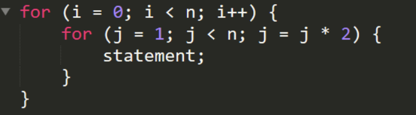

# Ejercicio 8

## Describe paso a paso cual es la complejidad del siguiente codigo

El primer bucle se ejecuta n veces, el segundo bucle como analisamos en el ejercicio 7 primer bucle, se ejecuta n1/2 -1 veces que tomaremos solo como n1/2 por que el -1 que es una constante en numeros grandes no infulye por tanto el orden de este algoritmo es O(n√n)
